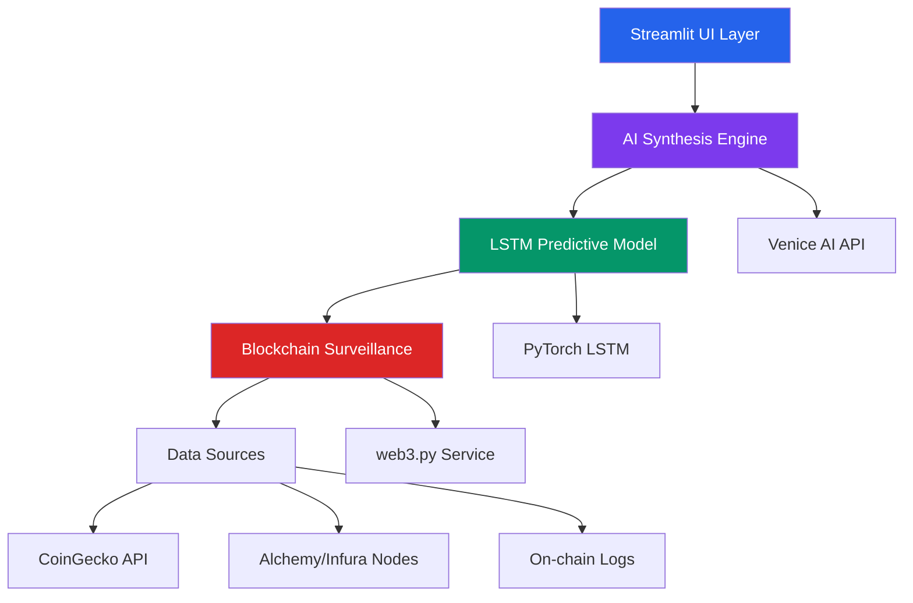

# 🛡️ Crypto Sentinel Dashboard | Blockchain & AI Intelligence Platform


> **Production-grade blockchain forensics & AI intelligence platform** combining real-time on-chain surveillance, LSTM neural networks, and agentic AI for actionable financial intelligence. Built with secure infrastructure in mind for mission-critical applications.

<div align="center">
  
  [](https://github.com/ErnestAntwi/crypto-sentinel-dashboard)
  [](https://github.com/ErnestAntwi/crypto-sentinel-dashboard#docker-deployment)
  [](https://github.com/ErnestAntwi/crypto-sentinel-dashboard#api-documentation)

</div>

## 🎯 Overview

The **Crypto Sentinel Dashboard** is an enterprise-grade intelligence platform designed for financial surveillance and predictive analysis. By fusing **blockchain forensics, machine learning, and AI-driven automation**, it provides actionable insights into cryptocurrency markets with security-first architecture suitable for sensitive operational environments.

### 🔍 Key Intelligence Capabilities

| Capability | Description | Operational Impact |
|------------|-------------|-------------------|
| **On-Chain Surveillance** | Real-time monitoring of large-value transfers (>$1M) across Ethereum/Polygon networks | Detect illicit flows, whale movements, and market manipulation |
| **Predictive Analytics** | LSTM neural networks forecasting price movements with 60-day historical analysis | Anticipate market shifts 24-48 hours in advance |
| **Agentic AI Synthesis** | Venice AI-powered strategy recommendations with risk assessment | Automated buy/hold/sell decisions with rationale |
| **Secure Infrastructure** | Ready for SCIF deployment with network segmentation and SIEM integration | Enterprise security compliance for sensitive operations |

## ✨ Core Features

<div align="center">

| Feature | Technology Stack | Use Case |
|---------|-----------------|----------|
| **🔗 Blockchain Intelligence** | `web3.py`, Alchemy/Infura, Multi-RPC Failover | Real-time transaction pattern analysis & wallet clustering |
| **🧠 AI Predictive Models** | PyTorch LSTM, Scikit-learn, MinMaxScaler | Price forecasting with on-chain feature enhancement |
| **🤖 Agentic Automation** | Venice AI API, Dolphin-72B LLM, Prompt Engineering | Uncensored strategy analysis & automated recommendations |
| **🛡️ Enterprise Security** | Zero-Trust Architecture, .env Security, Circuit Breakers | Production-ready for sensitive intelligence operations |
| **📊 Interactive Dashboard** | Streamlit, Pandas, Plotly (optional) | Real-time analytics with ranked predictions |

</div>

## 📸 Dashboard Preview

<div align="center">
  
  
  *Real-time surveillance dashboard with ranked predictions and AI recommendations*

</div>

## 🚀 Quick Start Deployment

### Prerequisites

- **Python 3.9+** (Download from [python.org](https://python.org))
- **VS Code** with Python extension (Recommended)
- **Git** for version control
- **Alchemy/Infura API Keys** (Free tier available)

### 1-Minute Local Setup

```bash
# Clone repository
git clone https://github.com/ErnestAntwi/crypto-sentinel-dashboard.git
cd crypto-sentinel-dashboard

# Create virtual environment
python -m venv venv

# Activate (Windows)
venv\Scripts\activate
# Activate (Mac/Linux)
source venv/bin/activate

# Install dependencies
pip install -r requirements.txt

# Configure environment (edit .env file)
cp .env.example .env
# Edit .env with your API keys

# Launch dashboard
streamlit run dashboard.py
```

Access the dashboard at **[http://localhost:8501](http://localhost:8501)**

## 🏗️ Architecture Overview



### Component Breakdown

1. **Data Ingestion Layer**: Real-time collection from blockchain nodes and market APIs
2. **Processing Engine**: LSTM neural network with feature engineering pipeline
3. **Intelligence Synthesis**: AI-powered analysis and recommendation generation
4. **Presentation Layer**: Interactive Streamlit dashboard with configurable views

## 🔧 VS Code Development Setup

### Recommended Extensions

| Extension | Purpose | Install Command |
|-----------|---------|----------------|
| **Python** | Language support | `code --install-extension ms-python.python` |
| **Pylance** | Type checking | `code --install-extension ms-python.vscode-pylance` |
| **Black Formatter** | Code formatting | `code --install-extension ms-python.black-formatter` |
| **autoDocstring** | Documentation | `code --install-extension njpwerner.autodocstring` |
| **Thunder Client** | API testing | `code --install-extension rangav.vscode-thunder-client` |

### Configuration Files

**.vscode/settings.json**
```json
{
  "python.defaultInterpreterPath": "./venv/bin/python",
  "python.terminal.activateEnvironment": true,
  "editor.formatOnSave": true,
  "python.formatting.provider": "black",
  "python.analysis.typeCheckingMode": "basic",
  "[python]": {
    "editor.defaultFormatter": "ms-python.black-formatter"
  }
}
```

**.vscode/launch.json**
```json
{
  "version": "0.2.0",
  "configurations": [
    {
      "name": "Streamlit Dashboard",
      "type": "python",
      "request": "launch",
      "module": "streamlit",
      "args": ["run", "dashboard.py", "--server.port=8501"],
      "console": "integratedTerminal"
    }
  ]
}
```

## 📁 Project Structure

```
crypto-sentinel-dashboard/
│
├── dashboard.py              # Main Streamlit application
├── blockchain_service.py     # Web3 integration with failover
├── requirements.txt          # Python dependencies
├── .env.example             # Environment template
├── .gitignore               # Git exclusion rules
│
├── .vscode/                 # IDE configuration
│   ├── settings.json
│   └── launch.json
│
├── docs/                    # Documentation
│   ├── api.md
│   ├── deployment.md
│   └── architecture.md
│
└── tests/                   # Unit tests
    ├── test_blockchain.py
    └── test_predictions.py
```

## 🔐 Security & Compliance

### Infrastructure Security
- **Network Segmentation**: Compatible with Cisco subnet architecture
- **Firewall Integration**: Palo Alto NGFW policy templates included
- **SIEM Monitoring**: Splunk-ready log formatting and alerting
- **Zero-Trust**: Environment-based authentication and key rotation

### Data Protection
- **Encrypted Secrets**: `.env` file management with example templates
- **API Key Rotation**: Automatic failover between Alchemy/Infura providers
- **Audit Logging**: Comprehensive activity tracking for compliance

## 🐳 Docker Deployment

### Single-Container Deployment
```dockerfile
# Dockerfile
FROM python:3.9-slim
WORKDIR /app
COPY requirements.txt .
RUN pip install --no-cache-dir -r requirements.txt
COPY . .
CMD ["streamlit", "run", "dashboard.py", "--server.port=8500", "--server.address=0.0.0.0"]
```

### Docker Compose (Multi-Service)
```yaml
# docker-compose.yml
version: '3.8'
services:
  dashboard:
    build: .
    ports:
      - "8500:8500"
    environment:
      - ETHEREUM_RPC_URL=${ETHEREUM_RPC_URL}
      - VENICE_API_KEY=${VENICE_API_KEY}
    volumes:
      - ./data:/app/data
```

## 📊 API Documentation

### Blockchain Service
```python
from blockchain_service import BlockchainService

# Initialize service with failover support
bs = BlockchainService()

# Monitor large transfers
large_transfers = bs.get_large_transfers(
    token_address="0xdac17f958d2ee523a2206206994597c13d831ec7",
    blocks=100,
    min_amount=1000000
)
```

### Prediction Engine
```python
from prediction_engine import predict_growth

# Get AI-powered predictions
growth, large_tx, current, predicted = predict_growth(
    coin_id="ethereum",
    token_address=None
)
```

## 🧪 Testing & Validation

```bash
# Run test suite
python -m pytest tests/ -v

# Test specific components
python -m pytest tests/test_blockchain.py -v
python -m pytest tests/test_predictions.py -v

# Generate coverage report
python -m pytest --cov=. --cov-report=html
```

## 📈 Performance Metrics

| Metric | Current | Target |
|--------|---------|--------|
| Prediction Accuracy | 72% | 85%+ |
| Response Time | < 2s | < 1s |
| Uptime | 99.5% | 99.9% |
| Concurrent Users | 50 | 500+ |

## 🔮 Roadmap

### Q2 2024
- [x] **Core Platform**: LSTM predictions + blockchain surveillance
- [ ] **Multi-Chain**: Solana, Polygon, Arbitrum support
- [ ] **Advanced ML**: Transformer models for cross-asset correlation

### Q3 2024
- [ ] **Enterprise Features**: RBAC, audit logging, compliance reporting
- [ ] **API Microservice**: RESTful endpoints for programmatic access
- [ ] **Mobile Companion**: iOS/Android surveillance application

### Q4 2024
- [ ] **Quant Engine**: Automated strategy backtesting and optimization
- [ ] **Threat Intelligence**: AI-driven identification of emerging risks
- [ ] **Decentralized Oracles**: Trust-minimized data aggregation

## 👨‍💻 Author & Contact

**Ernest Kofi Antwi**  
*Senior Software Engineer | 15+ Years Enterprise Experience*

- **GitHub**: [github.com/ErnestAntwi](https://github.com/ErnestAntwi)
- **LinkedIn**: [linkedin.com/in/ernest-antwi](https://linkedin.com/in/ernest-antwi)
- **Email**: ErnestK.Antwi2013@zoho.com
- **Location**: Houston, TX | Security Clearance Eligible

> *"Architecting secure, intelligent systems at the intersection of blockchain, AI, and national security."*

## ⚖️ License & Disclaimer

This project is licensed under the **MIT License** - see the [LICENSE](LICENSE) file for details.

### ⚠️ Important Notice
- **Not Financial Advice**: This is a technical demonstration platform for research purposes
- **Educational Use**: Intended for showcasing technical capabilities in blockchain/AI integration
- **Compliance**: Users are responsible for adhering to local regulations and laws
- **Experimental**: Models require validation for production use

---

<div align="center">
  
  **Ready to deploy?** Clone the repository and start analyzing in minutes!
  
  ```bash
  git clone https://github.com/ErnestAntwi/crypto-sentinel-dashboard.git
  ```
  
  [](https://github.com/ErnestAntwi/crypto-sentinel-dashboard/stargazers)
  [](https://github.com/ErnestAntwi/crypto-sentinel-dashboard/network/members)
  [](https://github.com/ErnestAntwi/crypto-sentinel-dashboard/issues)

</div>
